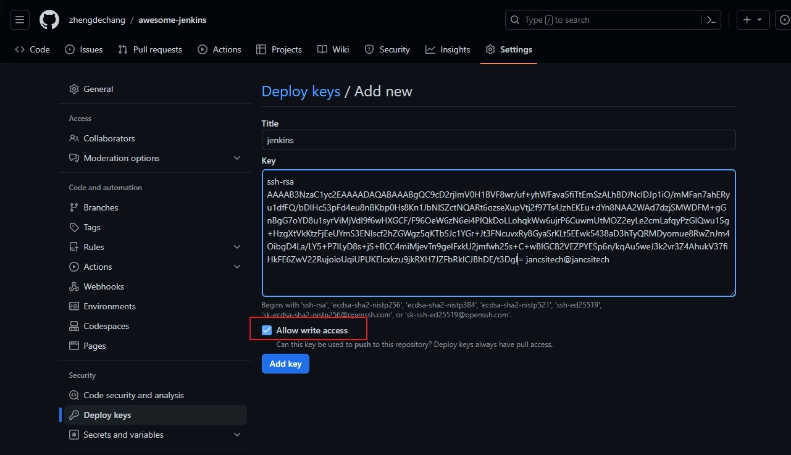

## 简体中文

- 简体中文 | [🇬🇧 English](#english)

# Awesome-Jenkins

Awesome-Jenkins 提供一键部署 Jenkins 服务的功能，同时也支持 Jenkins 任务（jobs）的备份操作。用户可以轻松迁移 Jenkins 服务，无需手动配置。

## 主要功能

- **一键部署**：只需一条命令，即可快速部署 Jenkins 服务。
- **任务备份**：自动备份 Jenkins 任务配置文件，支持两种备份方式。

## 使用方法

运行以下命令，即可一键部署 Jenkins：

```shell
bash <(curl -sSL https://raw.githubusercontent.com/zhengdechang/awesome-jenkins/main/jenkins-install.sh)
```

## 备份方式

Awesome-Jenkins 提供了两种 Jenkins 任务备份方式：

1. **默认备份**：每天自动下载任务配置文件到 `/srv` 文件夹。
2. **Git 备份**：如果提供 `GIT_REPO` 环境变量和 `id_rsa` 文件（放在脚本执行目录下），每天会自动下载任务配置，并提交到相应的 Git 仓库。
   
```shell
## 提交设置好id_rsa文件，命令：ssh-keygen -t rsa
export GIT_REPO=git@github.com:zhengdechang/awesome-jenkins.git
bash <(curl -sSL https://raw.githubusercontent.com/zhengdechang/awesome-jenkins/main/jenkins-install.sh)
```

## 添加 SSH KEYS(github)

##### 1. 生成 SSH KEY

```shell
ssh-keygen -t rsa
```

##### 2. 添加 SSH KEY 到 github

```shell
cat ~/.ssh/id_rsa.pub
```

##### 3. 复制 SSH KEY 到 github

- 浏览器打开https://github.com/settings/keys
- 点击 New SSH key
- title 随便写
- key 复制 id_rsa.pub 文件内容



## English

- [简体中文](#简体中文) | 🇬🇧 English

# Awesome-Jenkins

Awesome-Jenkins provides a one-click deployment feature for Jenkins services, and also supports backup operations for Jenkins jobs. Users can easily migrate Jenkins services without manual configuration.

## Main Features

- **One-Click Deployment**: With just one command, you can quickly deploy a Jenkins service.
- **Job Backup**: Automatically backs up Jenkins job configuration files, supporting two backup methods.

## Usage

Run the following command to deploy Jenkins with one click:

```shell
bash <(curl -sSL https://raw.githubusercontent.com/zhengdechang/awesome-jenkins/main/jenkins-install.sh)
```

## Backup Methods

Awesome-Jenkins provides two backup methods for Jenkins jobs:

1. **Default Backup**: Automatically downloads job configuration files to the `/srv` folder every day.
2. **Git Backup**: If the `GIT_REPO` environment variable and `id_rsa` file (placed in the script execution directory) are provided, it will automatically download job configurations and commit them to the corresponding Git repository every day.

```shell
## Set the id_rsa file, command: ssh-keygen -t rsa
export GIT_REPO=git@github.com:zhengdechang/awesome-jenkins.git
bash <(curl -sSL https://raw.githubusercontent.com/zhengdechang/awesome-jenkins/main/jenkins-install.sh)
```

## Adding SSH KEYS (github)

##### 1. Generate SSH KEY

```shell
ssh-keygen -t rsa
```

##### 2. Add SSH KEY to github

```shell
cat ~/.ssh/id_rsa.pub
```

##### 3. Copy SSH KEY to github

- Open https://github.com/settings/keys in your browser
- Click on New SSH key
- Enter any title
- Copy the content of the id_rsa.pub file into the key field


